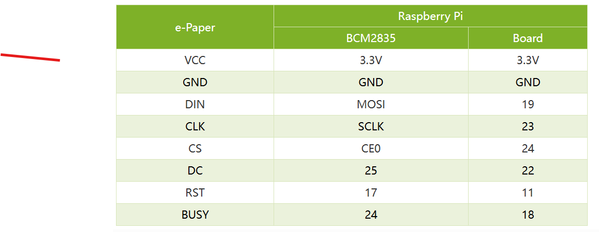

# Conección de los pines de los diferentes dispositivos.

---

## ✅ **1. Pines WS2812B (con Level Shifter)**

| Función    | Pi Pin Físico | GPIO       | Correcto                                                           |
| ---------- | ------------- | ---------- | ------------------------------------------------------------------ |
| Data       | **12**        | **GPIO18** | ✅ Recomendado para PWM, compatible con librerías como `rpi_ws281x` |
| GND        | 6, 9, etc.    | -          | ✅ Cualquiera de los pines GND está bien                            |
| VCC        | 2 o 4         | 5V         | ✅ Correcto, los WS2812B requieren 5V de alimentación               |
| Shifter LV | 1 o 17        | 3.3V       | ✅ Para lógica baja (del lado Raspberry Pi)                         |
| Shifter HV | 2 o 4         | 5V         | ✅ Alimentación de 5V para lado alto (hacia LED)                    |

---

## ✅ **2. Pines Pantalla E-Ink 2.13” V4 (SPI)**

Confirmado según documentación de Waveshare:

[docs](https://www.waveshare.com/wiki/2.13inch_e-Paper_HAT_Manual#Working_With_Raspberry_Pi)

---

## ✅ **3. USB to Serial TTL (UART)**

| Función          | Pi Pin Físico | GPIO       | Confirmación        |
| ---------------- | ------------- | ---------- | ------------------- |
| TXD (Salida Pi)  | **8**         | **GPIO14** | ✅ UART TXD estándar |
| RXD (Entrada Pi) | **10**        | **GPIO15** | ✅ UART RXD estándar |
| GND              | 6, 9, etc.    | -          | ✅ Correcto          |

---

## 🔎 **Resumen Final Validado**

| Pin Físico | GPIO | Uso                                    | Estado |
| ---------- | ---- | -------------------------------------- | ------ |
| **12**     | 18   | PWM para LEDs WS2812B                  | ✅ OK   |
| **2 / 4**  | -    | 5V para WS2812B y HV del level shifter | ✅ OK   |
| **1 / 17** | -    | 3.3V para E-Ink y LV del shifter       | ✅ OK   |
| **6 / 9**  | -    | GND común para todo                    | ✅ OK   |
| **19**     | 10   | SPI MOSI → E-Ink DIN                   | ✅ OK   |
| **23**     | 11   | SPI CLK → E-Ink CLK                    | ✅ OK   |
| **24**     | 8    | SPI CS0 → E-Ink CS                     | ✅ OK   |
| **22**     | 25   | E-Ink DC                               | ✅ OK   |
| **18**     | 24   | E-Ink RST                              | ✅ OK   |
| **16**     | 23   | E-Ink BUSY                             | ✅ OK   |
| **8**      | 14   | UART TXD                               | ✅ OK   |
| **10**     | 15   | UART RXD                               | ✅ OK   |

---

### ✅ **Veredicto:**

**Todos los pines están correctos y asignados de acuerdo con el hardware oficial de Raspberry Pi.**
No hay errores ni superposiciones.
