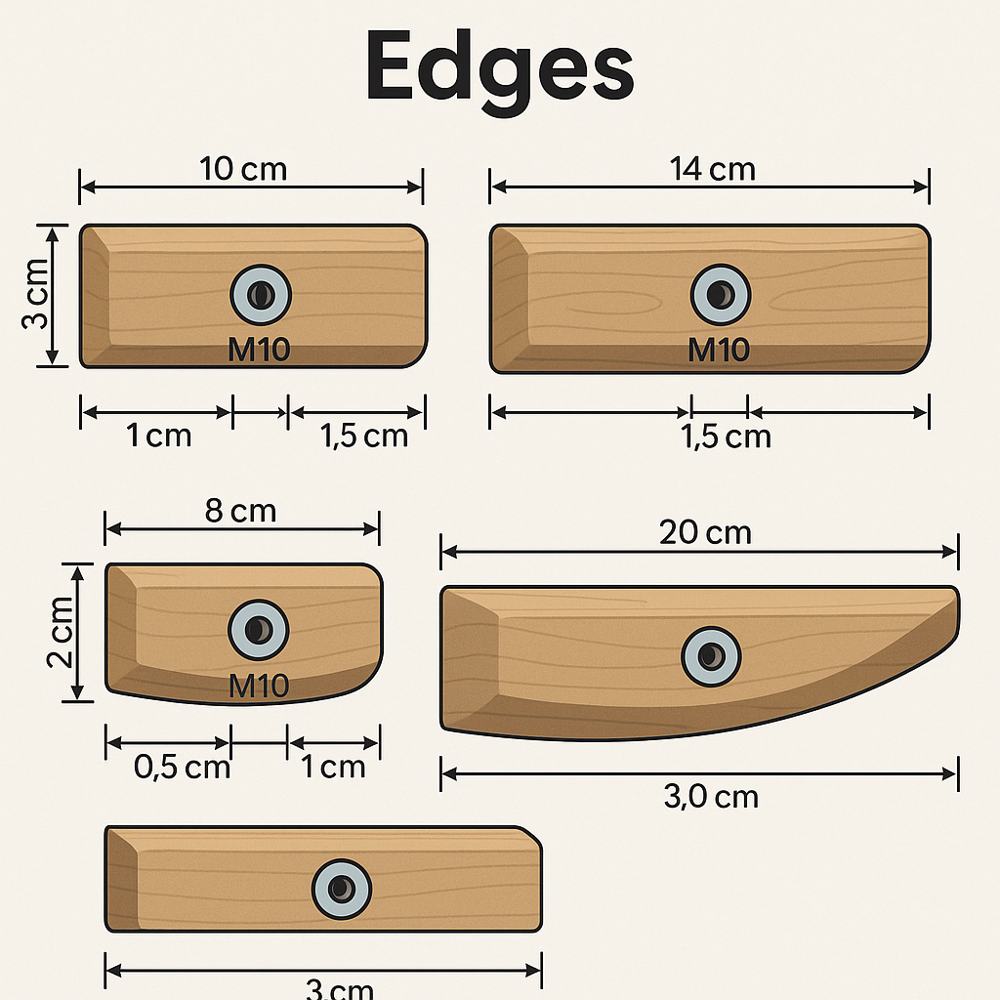
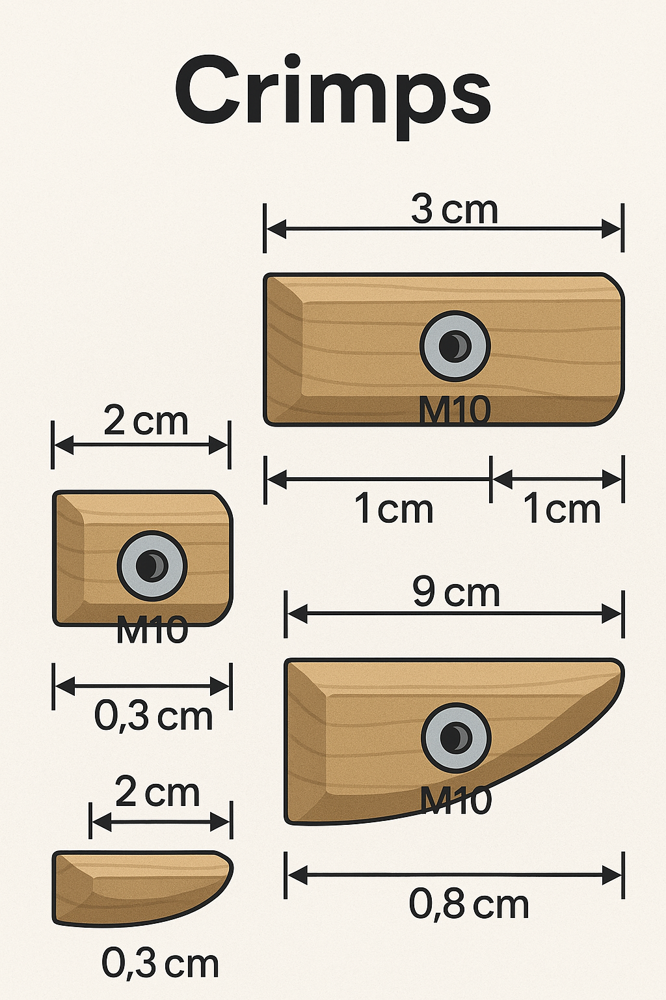
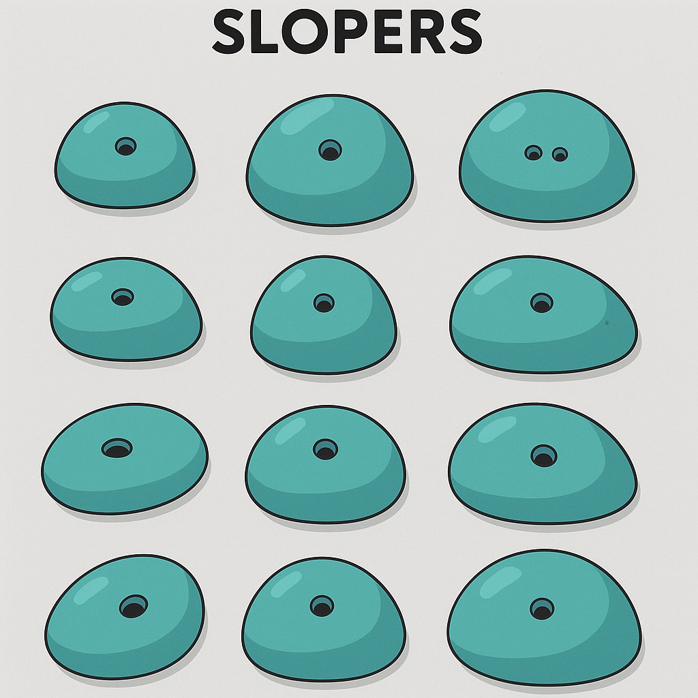
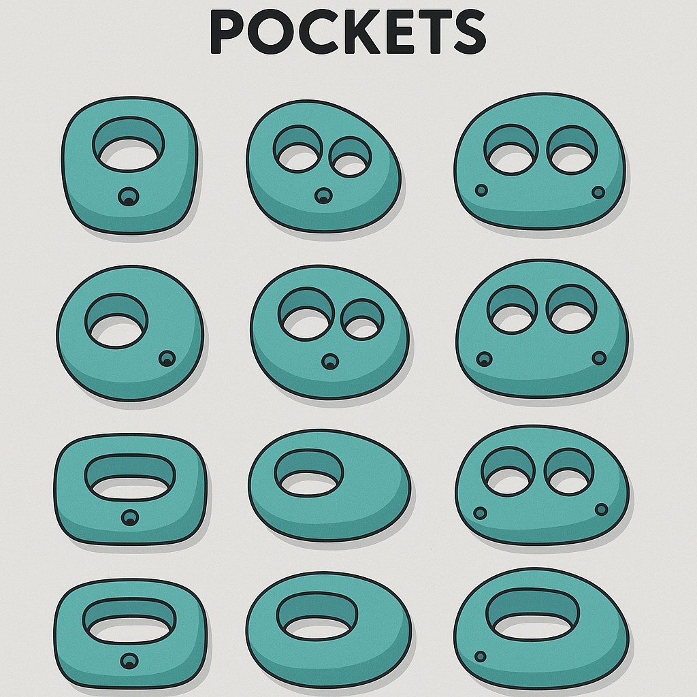
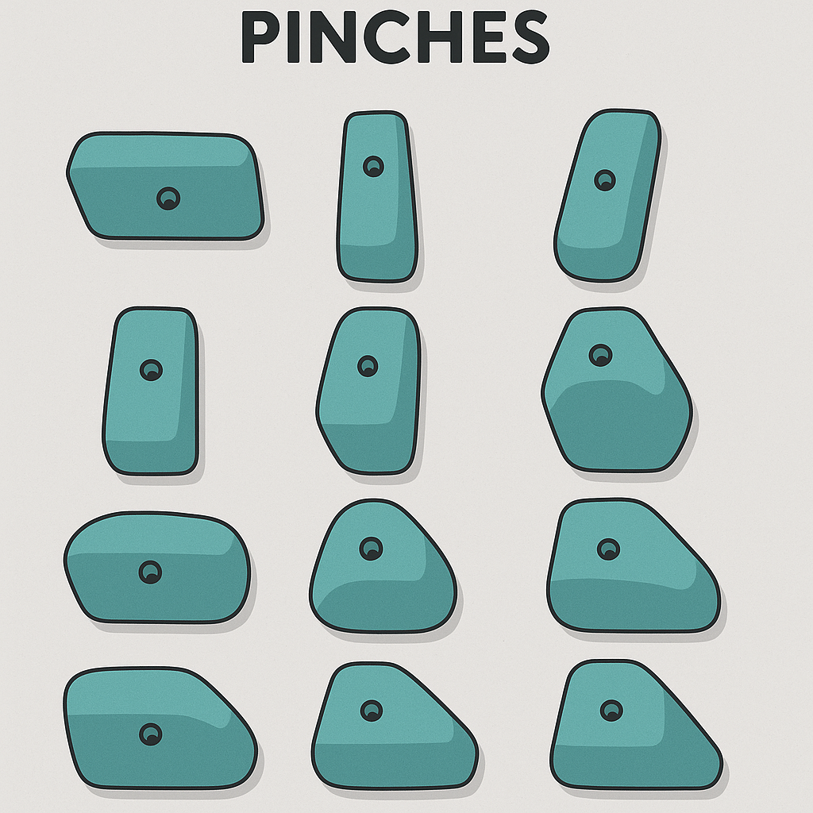
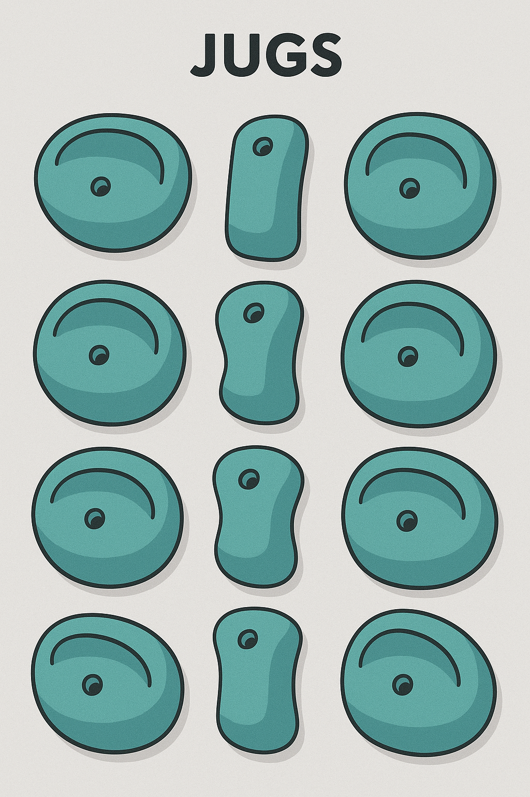
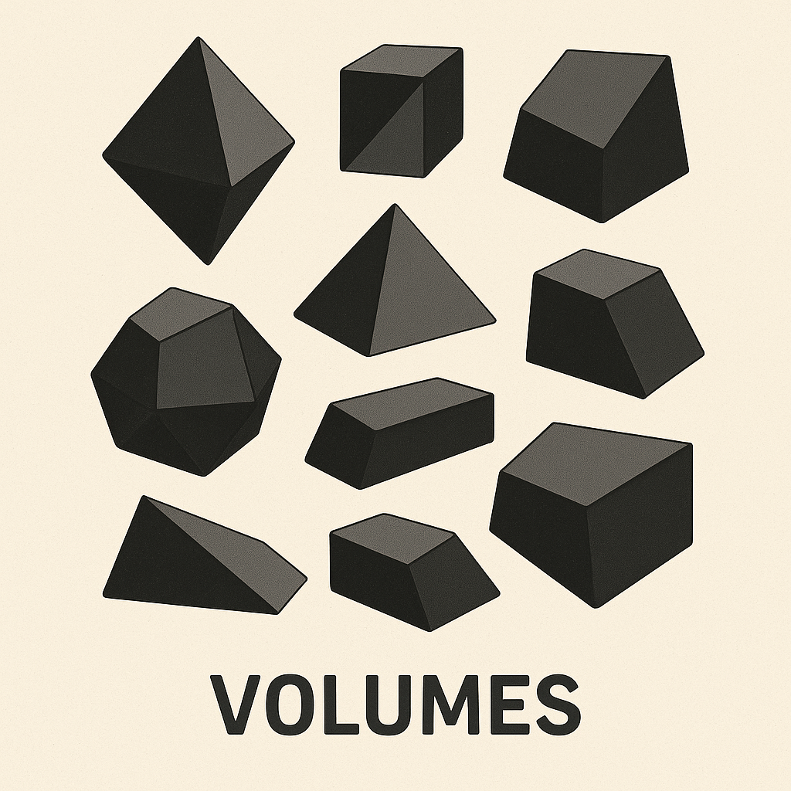

# 📋 Guía de Presas y Texturas para MoonBoard y Muros de Escalada

---

## 📑 Índice

1. [Tipos de Presas de Escalada](#🧗-tipos-de-presas-de-escalada)
   - [Edges (Cantos o Romos Pequeños)](#1️⃣-edges-cantos-o-romos-pequeños)
   - [Crimps (Regletas Afiladas)](#2️⃣-crimps-regletas-afiladas)
   - [Slopers (Bolas o Presas Redondeadas)](#3️⃣-slopers-bolas-o-presas-redondeadas)
   - [Pockets (Agujeros)](#4️⃣-pockets-agujeros)
   - [Pinches (Presas para Pinzar)](#5️⃣-pinches-presas-para-pinzar)
   - [Jugs (Cazos Grandes)](#6️⃣-jugs-cazos-grandes)
2. [Sets Oficiales de MoonBoard (Referenciales)](#🛠️-sets-oficiales-de-moonboard-referenciales)
3. [Tipos de Texturas en Presas de Escalada](#🔹-tipos-de-texturas-en-presas-de-escalada)
   - [Rugosa / Áspera (Grit / Rough)](#1️⃣-rugosa--áspera-grit--rough)
   - [Grano Fino (Fine Grit / Smooth Grit)](#2️⃣-grano-fino-fine-grit--smooth-grit)
   - [Lisa (Smooth / Slick)](#3️⃣-lisa-smooth--slick)
   - [Natural / Orgánica (Rock-Like / Sandstone / Granite)](#4️⃣-natural--orgánica-rock-like--sandstone--granite)
   - [Microtextura (Microskin / Micropores)](#5️⃣-microtextura-microskin--micropores)
   - [Mixta (Mixed Texture)](#6️⃣-mixta-mixed-texture)
4. [Relación entre Material y Textura](#🔧-relación-entre-material-y-textura)
5. [¿Para Qué Sirve Cada Textura?](#🎯-para-qué-sirve-cada-textura)

---

## 🧗 Tipos de Presas de Escalada

Las presas se clasifican según la forma y el tipo de agarre que requieren:

### 1️⃣ **Edges (Cantos o Romos Pequeños)**

- Superficies estrechas donde solo caben las yemas de los dedos.
- Ideales para fuerza de dedos y precisión.
- **Tamaño aprox:**
   - Ancho: 8-20 cm
   - Altura: 2-4 cm
   - Profundidad de agarre: 0.5-1.5 cm
- **Diseño:**
   - Rectangulares, bordes romos o levemente redondeados.
   - Pueden estar ligeramente inclinados (positivos o negativos).

### 2️⃣ **Crimps (Regletas Afiladas)**

- Regletas pequeñas y cortantes.
- Se usan con agarre en “crimp” (doblando las falanges).
- Muy utilizadas en muros como el MoonBoard.
- **Tamaño aprox:**
   - Ancho: 5-15 cm
   - Altura: 2-3 cm
   - Profundidad de agarre: 0.3-1 cm
- **Diseño:**
   - Rectas o ligeramente curvadas, con cantos definidos.
   - Algunas pueden tener un "lip" para crimp cerrado.
- **Consejo:**
   - Úsalas en muros con menos desplome o combínalas con inclinaciones para variar la dificultad.

### 3️⃣ **Slopers (Bolas o Presas Redondeadas)**

- Presas redondeadas sin cantos definidos.
- Requieren control corporal y buena fricción.
- **Tamaño aprox:**
   - Diámetro: 10–25 cm
   - Altura desde el panel: 5–15 cm
- **Diseño:**
   - Semiesféricos o con forma de cúpula aplanada.
   - Textura arenosa para fricción, superficie continua sin cantos.
- **Consejo:**
   - Funcionan bien en zonas centrales o de pasos técnicos.

### 4️⃣ **Pockets (Agujeros)**

- Agujeros para uno, dos o tres dedos.
- Piden fuerza puntual en dedos.
- Menos comunes por riesgo de lesión.
- **Tamaño aprox (diámetro del agujero):**
   - Mono: 2–2.5 cm
   - Dúo: 3–4 cm
   - Trío: 4.5–5.5 cm
   - Completo: 6–8 cm
   - Profundidad: 2–4 cm
- **Diseño:**
   - Presas gruesas con bordes redondeados alrededor del agujero.
   - Ángulo ligeramente inclinado hacia arriba para mayor seguridad.
- **⚠️ Precaución:**
   - No exagerar el ángulo ni el filo del borde para evitar lesiones.

### 5️⃣ **Pinches (Presas para Pinzar)**

- Permiten agarrarse con toda la mano en forma de pinza.
- Requieren fuerza de antebrazo y control de presión.
- **Tamaño aprox:**
   - Altura: 10–20 cm
   - Ancho: 4–8 cm
   - Profundidad: 3–6 cm
- **Diseño:**
   - Bordes paralelos o convergentes, superficies opuestas rugosas.
   - Algunas pueden tener un lado más positivo.
- **Consejo:**
   - Colócalas en zonas de compresión o pasos laterales.

### 6️⃣ **Jugs (Cazos Grandes)**

- Agarre fácil y cómodo, ideales para calentamiento y descansos.
- Normalmente en partes superiores o muros muy desplomados.
- **Tamaño aprox:**
   - Ancho: 10–25 cm
   - Profundidad de agarre: 3–6 cm
   - Altura desde el panel: 5–10 cm
- **Diseño:**
   - Formas redondeadas con reborde profundo.
   - Cóncavos, con hueco cómodo para dedos completos.
- **Ideal para:**
   - Calentamiento, iniciantes, pasos de descanso, movimientos dinámicos.

### 7️⃣ **Volumes (Volúmenes)**
- Estructuras grandes que sobresalen del muro.
- Pueden tener diferentes formas y texturas.
- Se usan para crear rutas más complejas y variadas.
- Pueden incluir múltiples tipos de presas en su superficie.
- **Tamaño aprox:**
   - Varía ampliamente, desde 30 cm hasta más de 1 metro de altura.
   - Profundidad y ancho también varían según el diseño.
- **Diseño:**
   - Pueden ser cúbicos, piramidales o con formas orgánicas.

### **Notas:**

- Las medidas son aproximadas y pueden variar según el fabricante.
- La elección de presas depende del nivel de dificultad y el tipo de entrenamiento deseado.
- La combinación de diferentes tipos de presas en un muro permite crear rutas variadas y desafiantes.
- La textura de las presas también influye en la dificultad y el tipo de agarre requerido.
- Las presas pueden ser de diferentes materiales como poliéster, resina, madera o fibra de vidrio, cada uno con sus propias características de fricción y durabilidad.
- Se puede hacer una combinación de texturas y materiales en cada presa para aumentar la complejidad del agarre.

---

## 🛠️ Sets Oficiales de MoonBoard (Referenciales)

| **Set**        | **Estilo de Presas**                     |
|----------------|------------------------------------------|
| 2016           | Cantos pequeños y crimps                  |
| 2017           | Mezcla de pinches, cantos y crimps         |
| Wood Holds     | Regletas y slopers en madera (técnico)     |
| Masters 2020   | Pinches, crimps, slopers, técnica moderna  |

---

## 🔹 Tipos de Texturas en Presas de Escalada

La textura influye en la fricción, dificultad y desgaste de la piel.

### 1️⃣ **Rugosa / Áspera (Grit / Rough)**

- Muy abrasiva, como lija.
- Máxima fricción, rápido desgaste de piel.
- Típica en presas antiguas de poliéster.

### 2️⃣ **Grano Fino (Fine Grit / Smooth Grit)**

- Fricción moderada, menos agresiva.
- Favorece técnica y control.

### 3️⃣ **Lisa (Smooth / Slick)**

- Superficie pulida, baja fricción.
- Requiere técnica, precisión y control corporal.
- Usual en madera o fibra.

### 4️⃣ **Natural / Orgánica (Rock-Like / Sandstone / Granite)**

- Imitación de roca real: arenisca, granito, caliza.
- Fricción irregular.
- Buscada en muros realistas.

### 5️⃣ **Microtextura (Microskin / Micropores)**

- Textura casi imperceptible.
- Fricción sutil, técnica exigente.

### 6️⃣ **Mixta (Mixed Texture)**

- Áreas lisas y áreas rugosas en una misma presa.
- Controla la colocación de manos e incrementa dificultad.

---

## 🔧 Relación entre Material y Textura

| **Material**       | **Textura Común**       |
|--------------------|-------------------------|
| Poliéster (PU)     | Rugosa / Grano fino      |
| Fibra de vidrio    | Lisa / Mixta / Microtextura |
| Resina             | Grano fino / Rugosa      |
| Madera             | Lisa / Microtextura      |

---

## 🎯 Para Qué Sirve Cada Textura

| **Textura**   | **Ideal para...**               |
|---------------|---------------------------------|
| Rugosa        | Fuerza, agarre fuerte, resistencia |
| Grano fino    | Técnica, menor desgaste de piel   |
| Lisa          | Técnica pura, fricción corporal   |
| Natural       | Realismo roca, entrenamiento outdoor |
| Microtextura  | Control y precisión máximos       |

---
