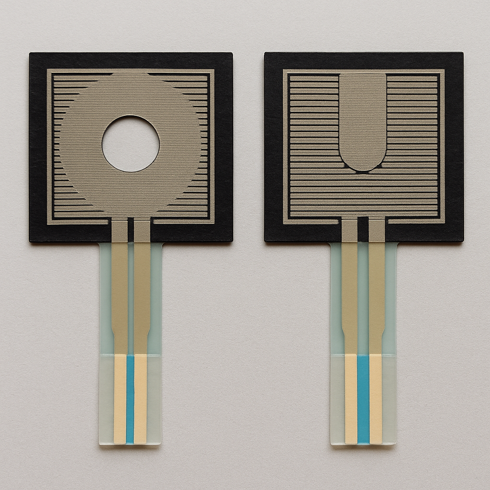
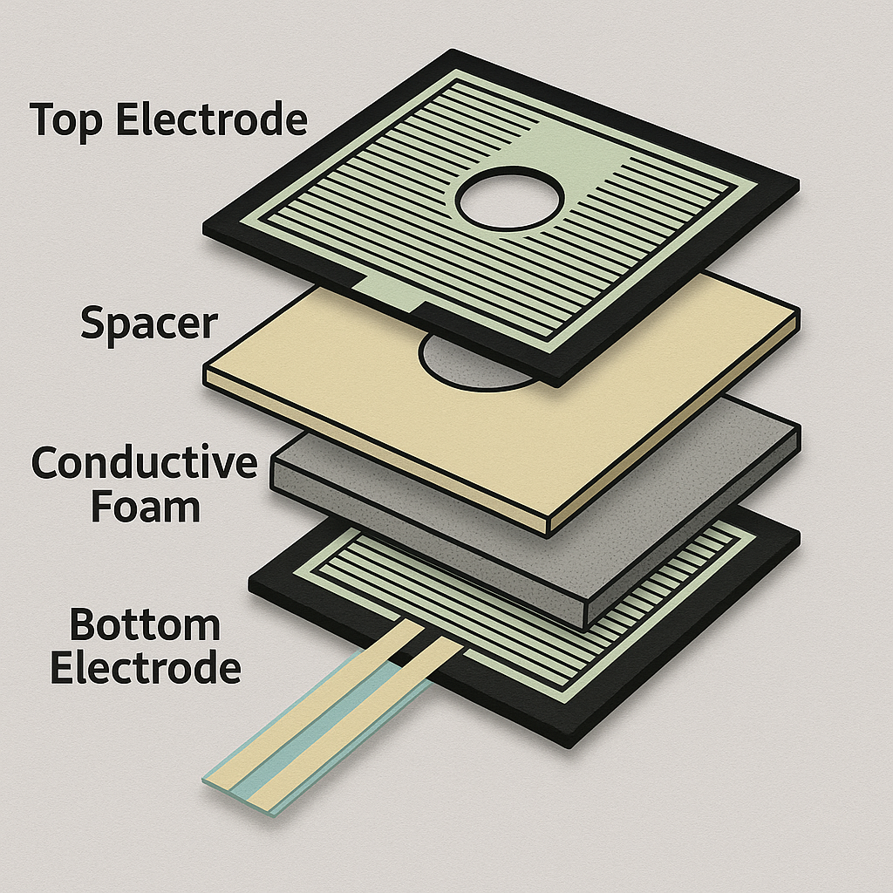

# 🧱 Sensor FSR Casero - Diseño y Construcción

Este documento describe la forma, dimensiones, capas y materiales recomendados para fabricar sensores FSR caseros, optimizados para su uso en un MoonBoard o muro de escalada.

---

## 🔷 Forma y Tamaño

| Tipo de presa       | Tamaño sugerido del sensor |
|---------------------|----------------------------|
| Presa pequeña (pie) | 2.5 × 2.5 cm o Ø 2.5 cm    |
| Presa mediana (mano)| 3 × 3 cm o Ø 3–3.5 cm      |
| Presa grande        | 4 × 4 cm o Ø 4 cm          |

- **Forma recomendada**: cuadrada o redonda.
- **Tamaño ideal universal**: 3 × 3 cm.
- Puede incluir una **perforación central** (Ø 5–6 mm) para permitir el paso del tornillo de la presa.
- Alternativamente, puede tener **forma de U** si prefieres evitar perforaciones.

---

## 🧩 Capas del sensor

### 1. **Top Electrode (Electrodo superior)**
- **Función**: capa conductora superior.
- **Materiales sugeridos**:
  - Cinta de cobre adhesiva.
  - Papel aluminio sobre acetato/cartón.
  - Hoja plástica con pintura conductiva (grafito, carbón).

### 2. **Spacer (Separador)**
- **Función**: evita contacto directo sin presión.
- **Características**:
  - Grosor: 0.5–1 mm.
  - Debe tener un **agujero central** alineado con la zona activa.
- **Materiales sugeridos**:
  - Cartulina, cinta doble faz, goma EVA fina, plástico.

### 3. **Conductive Foam (Espuma conductiva)**
- **Función**: varía su resistencia según la presión.
- **Materiales sugeridos**:
  - Espuma antiestática negra (de embalaje electrónico).
  - Espuma impregnada con grafito.
  - Goma EVA con tinta conductiva casera.

### 4. **Bottom Electrode (Electrodo inferior)**
- **Función**: cierre del circuito.
- **Materiales sugeridos**:
  - Igual que el superior.
  - Base rígida o flexible, con pines de conexión o cables soldados.

---

## 🔌 Conexión Eléctrica

- Se conecta como una **resistencia variable** en un divisor de voltaje.
- Terminales: A y B (no polarizado).
- Lectura: entre nodo medio del divisor y ADC.

---

## 🛠️ Consejos de montaje

- Fijar el sensor detrás de la **presa**, entre el **tornillo y la lámina de triplay**.
- Asegurarlo con cinta doble faz o silicona delgada.
- No debe estar directamente debajo del tornillo si no tiene perforación.
- Se puede usar un **bumper de silicona o goma** sobre la zona sensible para transmitir mejor la presión.

---

## 📦 Recomendaciones finales

- Prueba primero con sensores de 3 × 3 cm con perforación central.
- Si el sensor se daña por presión excesiva, ajusta el grosor del separador o usa espuma más firme.
- Puedes hacer pruebas de presión midiendo la resistencia entre los pines con un multímetro.
